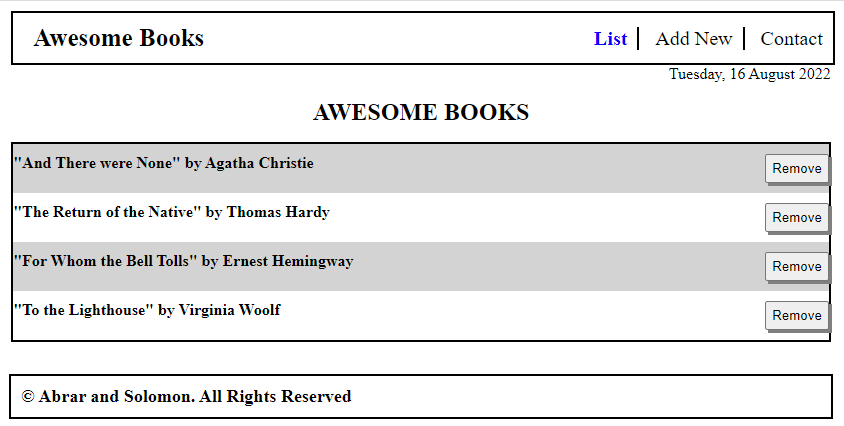

# Awsome-Books-E6
>This is a ES6 project, the project converted form [awesome-books-project](https://github.com/Abrar052/awsome-books-project) to Awsome-Books-ES6. The purpose of this project is to implement the ES6 syntax for better understanding and learning.

## Learning objectives

- Use ES6 modules to write modular JavaScript.
- Learn how to use proper ES6 syntax.
- Understand improvements that ES6 brings to JavaScript.
- Use npm as software packages system.
## Built With

- Major languages (HTML & CSS & JavaScript)
- Frameworks (HTML & CSS)
- Technologies used (VS Code)
- luxon
- single page aplication

## Live Demo

[Live Demo Link](https://abrar052.github.io/Awsome-Books-E6/)

## Project Preview
-

## Getting Started

### To launch the project locally:

#### Step 1:
- Clone this repo locally using git and the following git command
	```bash 
	git clone https://github.com/Abrar052/Awsome-Books-E6.git
	```
- or with GitHub CLI
	```bash
	gh repo clone Abrar052/Awsome-Books-E6
	```

#### Step 2:

- install dependency
	```bash
	npm install
	```

#### Step 3:

- Run index.html file in your browser or run a live server


### Prerequisites
Basic knowledge of HTML & CSS

### Setup
HTML & CSS & JavaScript

### Install
VS Code

### Usage
With this Project you can create a Book Store where you can add Books with auther's name and can Delete any Book from the list you wanto

## Authors

👤 **Abrar Hussain**

- GitHub: [@githubhandle](https://github.com/Abrar052)
- Twitter: [@twitterhandle](https://twitter.com/bc160400820)
- LinkedIn: [LinkedIn](https://www.linkedin.com/in/abrar-hussain-225589238/)


## 🤝 Contributing

Contributions, issues, and feature requests are welcome!

Feel free to check the [issues page](../../issues/).

## Show your support

Give a ⭐️ if you like this project!

## 📝 License

This project is [MIT](./MIT.md) licensed.
